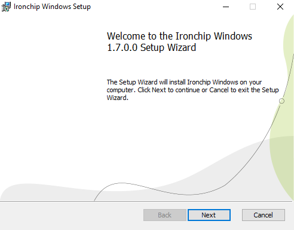
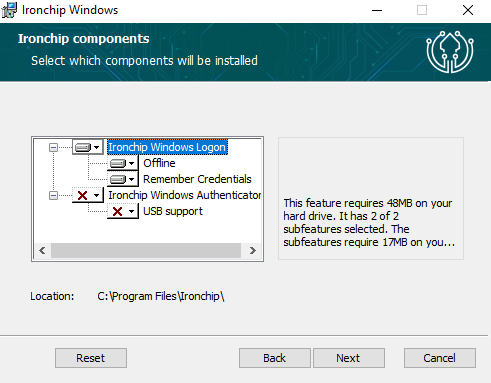
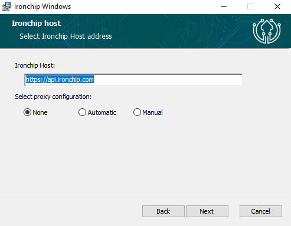
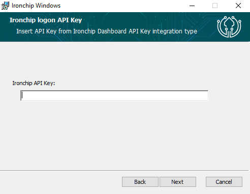
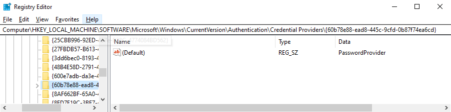
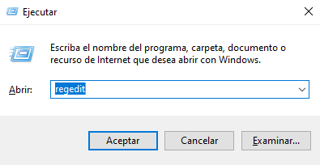
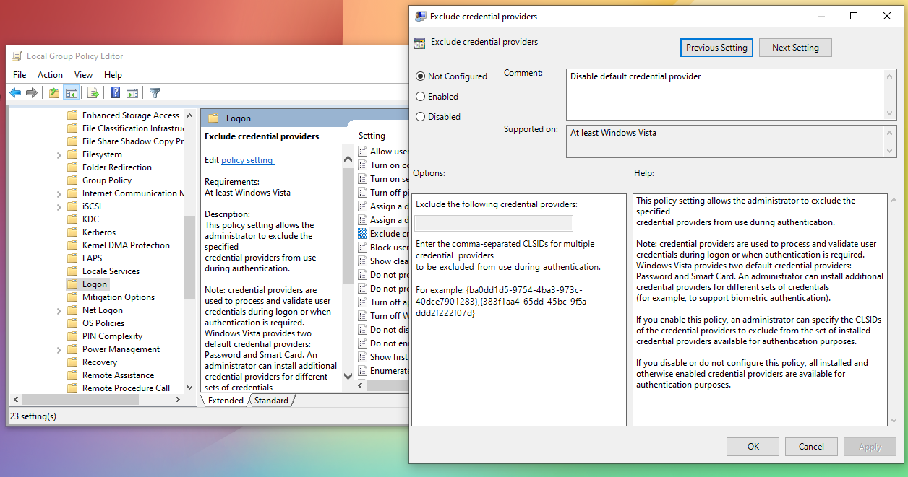
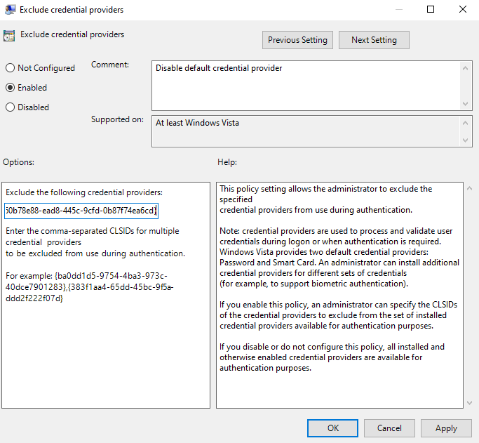
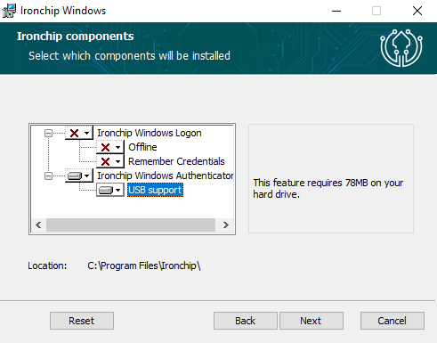

  

<h1 align="center">Ironchip</h1>

    
  
  
  
  

## IDENTITY PROTECTION

Elevate your cybersecurity strategy with Ironchip Identity Platform, designed to bring the power of Multi-Factor Authentication (MFA) to your desktop computing environment. [Know more](https://www.ironchip.com/solutions/identity_platform/win-mac-linux/).

**Role-based privilege management:**
Set different user privileges. Prevents unauthorized users from accessing the rest of the system and misusing information, mitigating malicious users.

**Restrict access from unauthorized places:**
Generate enabled access from authorized areas and take your security to the next level.

**Supervision of accesses in real time:**
Check user activity, view access on a timeline, get reports and download them for full control.

**Intrusion detection system (IDS):**
Location-based reporting system to alert of sim swapping, phishing, device switching, etc.

 

## Download

Download the latest installer (`.msi`) version from [Release](https://github.com/mikel-jauregui-ironchip/test-docu/releases) or [Nexus](https://nexus6.kydom.net/#browse/browse:Ironchip_Windows_Logon).

## Logon

### What it is
Logon is a custom Windows credential provider designed by [Ironchip](https://www.ironchip.com/) to bring the power of Multi-Factor Authentication (MFA) to your desktop computing environment.

**Cached Passwords:**
Our simplified access can enhance user experience, making it more convenient and user-friendly. This is especially valuable in a work or personal environment where you're required to log in to various systems multiple times a day.

**Extra Layer:**
MFA adds an extra layer of protection, requiring multiple forms of authentication, such as a password and a one-time code or push notification. 

**Improved Compliance:**
MFA helps organizations meet compliance requirements and security standards by implementing robust authentication methods.

### Installing process

To install the Ironchip Authenticator into your device:
 - Run the downloaded installer. This will open the installer stepper:
   

     
   

 - Follow the installation steps until you arrive to the **Component Selection View**. To have the ironchip windows logon installed, the **Ironchip Windows Logon** must be `enabled`.

   > In case you want to have available the possibility to log without internet connection, make sure to `enable` **Offline** feature.
   
   > In case you want to have available the possibility to cache the password for better user experience, make sure to `enable` **Remember Credentials** feature.

   

     
   

 - Continue to the following page, where you can change the target host and the desired proxy selection:
   
   > The host for **Production** environment: `https://api.ironchip.com`.\
   The host for **Testing** environment: `https://testing.api.ironchip.com`.
   

     
   

 - Continue to the following page, where you must insert the target **ApiKey** :
    > The **ApiKey** can be copied or download when [generating the application](https://knowledge.ironchip.com/en/create-mfa-application-on-ironchip) from the [Dashboard](https://app.ironchip.com/).
   

     
   

 - Once the installation process is finished. All you need to do is for an administrator to [give access](https://knowledge.ironchip.com/en/windows-logon) from the [Dashboard](https://app.ironchip.com/).
 > If the **Offline** feature is enabled and the user want to use it, they need to [follow the steps](https://knowledge.ironchip.com/en/user-manual-indentity#offline) to generate the `Time-based one-time password`.

### Disable default credential provider

In order to force user to use **Ironchip Credential Provider**, the default **Windows Credential Provider** must be disabled.

> The paths may vary depending on the language

#### Steps:
- Now get the **GUID** of the Windows Credential Provider. Normally it's `{60b78e88-ead8-445c-9cfd-0b87f74ea6cd}` but you can check it on the registry under the path `Computer\HKEY_LOCAL_MACHINE\SOFTWARE\Microsoft\Windows\CurrentVersion\Authentication\Credential Providers\{60b78e88-ead8-445c-9cfd-0b87f74ea6cd}`

  

- Use the key shortcut `⊞ Win` + `R` and paste `gpedit.msc`

  

- Then inside the **Local Group Policy Editor** go to `Local Computer Policy > Computer Configuration > Administrative Templates > System > Logon > Exclude Credential Providers`

  

- Enable the exclusion rule and paste the GUID of the Windows Password Credential Provider into the field. Then press apply.

  

### Autologon Whitelist

In order to prevent user interact in authentication during autologon on computer start up, there are 2 possibilities

**Whitelist user:**
Adding user to Registry key `Computer\HKEY_LOCAL_MACHINE\SOFTWARE\Ironchip\Logon\Whitelist`. This will whitelist autologon user for any authentication

**Whitelist user just on autologon:**
Setting AutoLogonSkip to 1 in `Computer\HKEY_LOCAL_MACHINE\SOFTWARE\Ironchip\Logon` this will whitelist autologon user for any authentication only during autologon

## Desktop Application

### What it is

Identity management must be nowadays considered as an essential component for security in organizations. To address this need, Ironchip provides organizations with the scalability and security necessary to offer their users a consistent experience and a reduced risk of vulnerabilities.

**Get a notification on your device**
Communication for authentication is done over a double-encrypted channel which implements a TLS plus asymmetric elliptic key encryption.

### Installing process

To install the Ironchip Authenticator into your device:
 - Run the downloaded installer. This will open the installer stepper:
   

     
   

 - Follow the installation steps until you arrive to the **Component Selection View**. To have the desktop application installed, the **Ironchip Windows Authenticator** must be `enabled`.

   > I case you want to have the **USB support** feature `enabled`, make sure to **enable USB support**.

   

     
   

 - Once the installation process is finished. All you need to do is [enroll the device](https://knowledge.ironchip.com/en/aplicaci%C3%B3n-de-escritorio#registro), and you are good to go.
